<p align="center">
  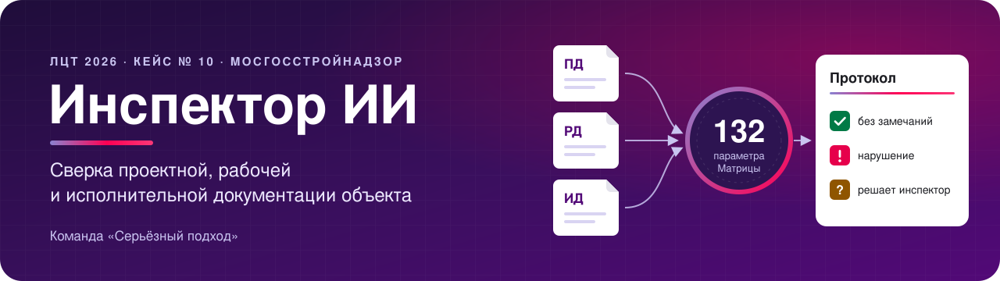
</p>

<p align="center">
  
  
  
  
  
  
  
</p>

**Инспектор ИИ** сверяет проектную, рабочую и исполнительную документацию объекта по Матрице
контроля из 132 параметров. Он собирает протокол с доказательствами и оставляет решение по каждому
расхождению инспектору.

<p align="center">
  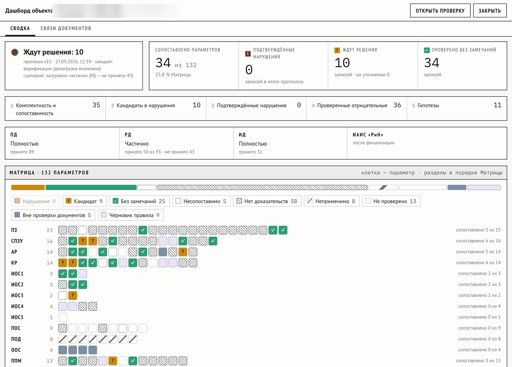
</p>

## Возможности

<table>
  <tr>
    <td width="33%" valign="top"><b>Объект целиком</b><br>ПД, РД и ИД загружаются папкой. Стадии, разделы и редакции система определяет сама.</td>
    <td width="33%" valign="top"><b>Карта Матрицы</b><br>132 параметра контроля на одном экране: нарушения, кандидаты и параметры без доказательств.</td>
    <td width="33%" valign="top"><b>Чертежи по помещениям</b><br>ПД и РД сравниваются по номеру помещения, зона доказательства отмечена на листе.</td>
  </tr>
  <tr>
    <td valign="top"><b>Связи и редакции</b><br>Граф документов между стадиями, цепочки редакций и изменения между ними.</td>
    <td valign="top"><b>Решение в один клик</b><br>Подтвердить, отклонить с причиной или уточнить — клавишами 1, 2, 3.</td>
    <td valign="top"><b>Протокол и передача</b><br>Протокол в PDF, DOCX и XML, финализация и передача в ИАИС «РиН».</td>
  </tr>
</table>

## Как это работает

<p align="center">
  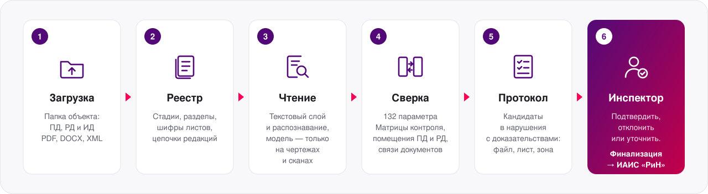
</p>

### Решение инспектора

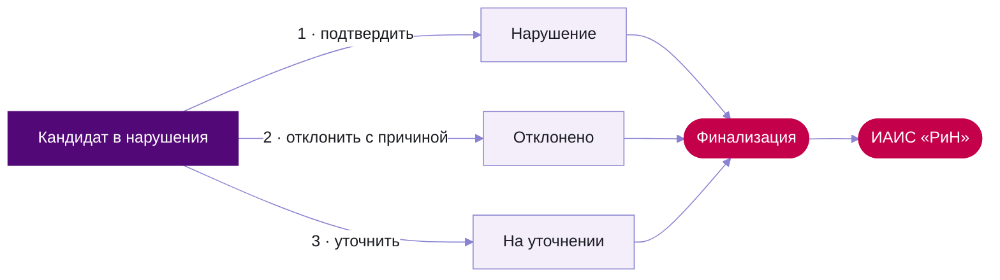

<p align="center">
  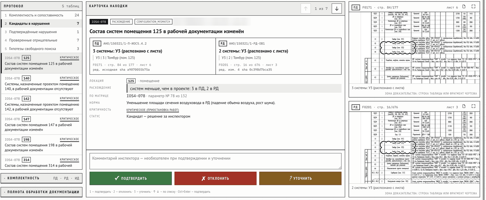
</p>

<details>
<summary><b>Жизненный цикл проверки</b></summary>

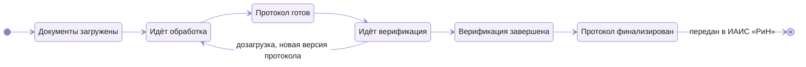

</details>

<details>
<summary><b>Экраны сервиса</b></summary>
<br>

<table>
  <tr>
    <td width="50%" valign="top">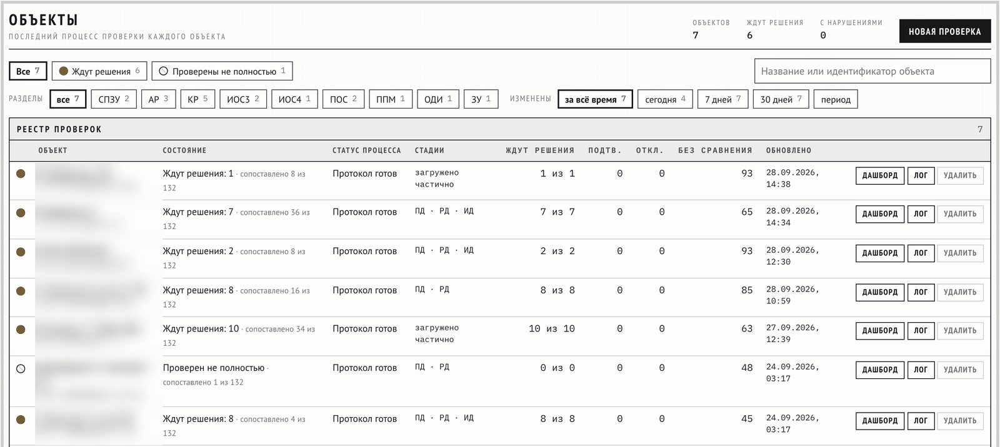<br><sub>Реестр проверок по объектам</sub></td>
    <td width="50%" valign="top">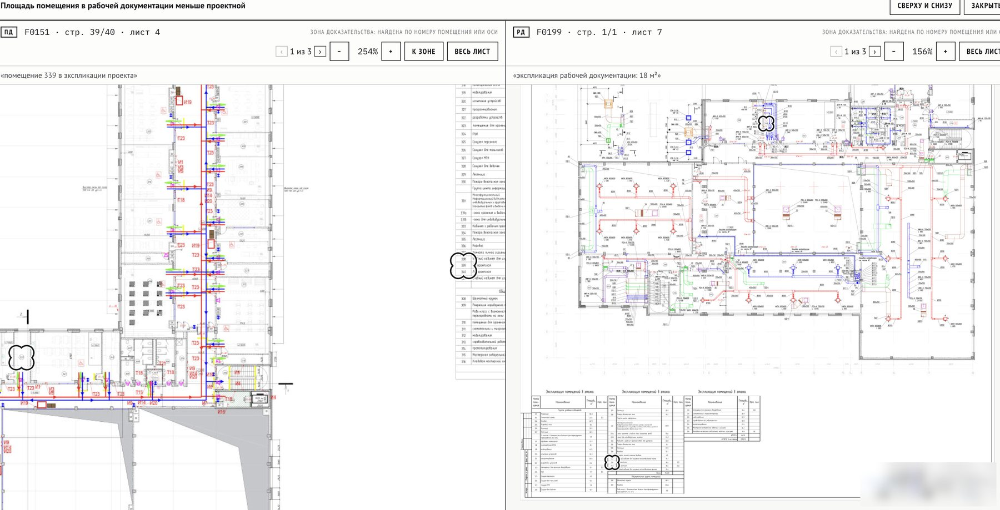<br><sub>Сравнение чертежей ПД и РД по помещению</sub></td>
  </tr>
  <tr>
    <td valign="top">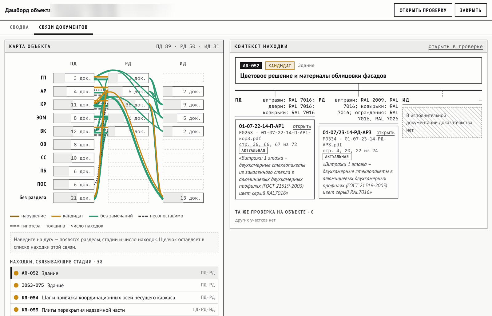<br><sub>Связи документов между стадиями</sub></td>
    <td valign="top">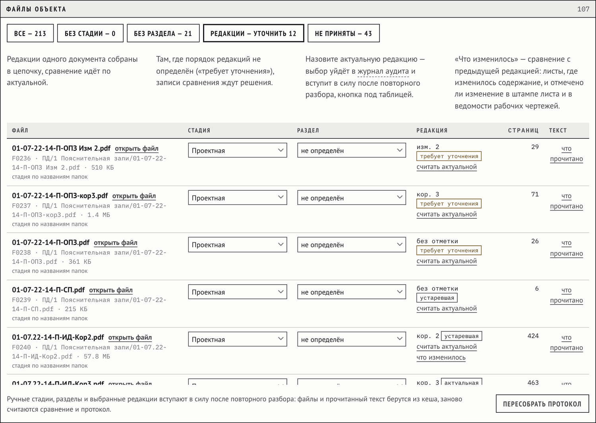<br><sub>Файлы объекта и цепочки редакций</sub></td>
  </tr>
  <tr>
    <td valign="top">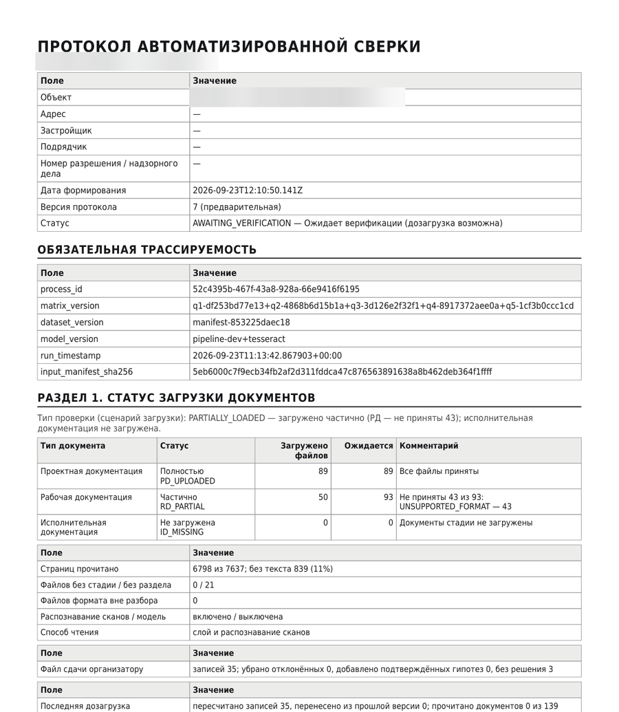<br><sub>Протокол проверки в PDF</sub></td>
    <td valign="top">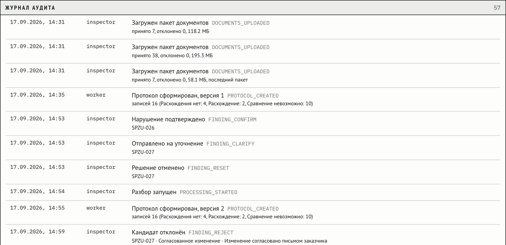<br><sub>Журнал аудита</sub></td>
  </tr>
</table>

</details>

## Быстрый старт

Нужны Docker с Compose 2.7 или новее и токен доступа к правилам Матрицы — его передаёт команда.

```bash
git clone https://github.com/AndreyStartsev/LCT2026.git && cd LCT2026
echo "RULES_TOKEN=<токен>" > .env
docker compose up --build
```

Откройте **http://localhost:8080** и войдите как `inspector` / `inspector`.

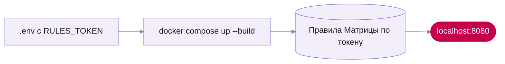

<details>
<summary><b>Учётные записи и адреса</b></summary>
<br>

| Логин и пароль | Роль |
|---|---|
| `inspector` / `inspector` | инспектор: проверка, решения, финализация |
| `admin` / `admin` | администратор: загрузка без лимитов, журнал аудита, отмена финализации |
| `expert` / `expert` | эксперт: права инспектора и страница правил с пробным прогоном |

| Адрес | Что |
|---|---|
| http://localhost:8080 | веб-клиент |
| http://localhost:3000/api/docs | API и Swagger |
| http://localhost:8090/mock/received | заглушка ИАИС «РиН»: что пришло |
| http://localhost:15672 | RabbitMQ, `guest` / `guest` |
| http://localhost:9001 | MinIO, пользователь `inspector`, пароль — `docker compose run --rm secrets cat /secrets/minio_password` |
| http://localhost:9090, http://localhost:3001 | Prometheus и Grafana, запуск с `--profile monitoring` |

Пароли базы, хранилища и ключ подписи токенов генерируются при первом запуске. Для любого контура,
кроме стенда, задайте свои учётные записи в `AUTH_USERS`.

</details>

<details>
<summary><b>Настройки</b></summary>
<br>

Настройки лежат в `.env` рядом с `docker-compose.yml`, образец — [`.env.example`](.env.example).
В Windows создайте `.env` в блокноте со строкой `RULES_TOKEN=<токен>`. В Linux и macOS `./build.sh`
соберёт и поднимет сервис одной командой и спросит токен сам.

| Переменная | Что задаёт |
|---|---|
| `RULES_TOKEN` | токен доступа к правилам Матрицы, нужен для сборки |
| `AUTH_USERS` | учётные записи `логин:пароль:роль` через запятую |
| `LLM_URL`, `LLM_MODEL`, `LLM_SERVER` | свой сервер модели чтения, см. ниже |
| `WEB_BIND` | адрес веб-клиента: по умолчанию только эта машина, `0.0.0.0` — вся сеть |
| `MAX_FILE_MB`, `MAX_PACKAGE_MB` | лимиты загрузки в браузере, по умолчанию 50 и 200 МБ |
| `IAIS_URL` | адрес ИАИС «РиН», по умолчанию заглушка |

Остальные переменные с пояснениями — в [`docker-compose.yml`](docker-compose.yml).

</details>

<details>
<summary><b>Стенд с видеокартой: поставка готовыми образами</b></summary>
<br>

Тот же сервис вместе с моделью чтения на видеокарте: vLLM и Qwen3.6-27B в FP8. Образы приходят
архивом от команды, правила уже внутри, интернет при работе не нужен.

```mermaid
%%{init: {"theme": "base", "themeVariables": {"primaryColor": "#F3EEFA", "primaryTextColor": "#1C1D22", "primaryBorderColor": "#8A83D1", "lineColor": "#8A83D1", "edgeLabelBackground": "#FFFFFF", "clusterBkg": "#FBFAFD", "clusterBorder": "#D9D4F2"}}}%%
flowchart LR
  tar["Архив образов"] -->|"docker load"| up["compose up с release.yml"]
  up --> check["release_check.sh"]
  check --> loader["Загрузчик: папка из input/"]
  loader --> out(["output/submission.json"])
  classDef done fill:#C4004A,stroke:#C4004A,color:#FFFFFF
  class out done
```

| Что нужно | |
|---|---|
| система | Linux x86-64, Docker 24+, Compose 2.20+, NVIDIA Container Toolkit |
| видеокарта | драйвер NVIDIA 575+, свободно не меньше 45 % памяти одной карты: веса около 31 ГБ |
| сервер | 24 ядра, 64 ГБ памяти, 150 ГБ диска |

```bash
sha256sum -c SHA256SUMS && docker load -i images-<тег>.tar
docker compose -f docker-compose.yml -f deploy/docker-compose.release.yml up -d
deploy/release_check.sh
docker compose -f docker-compose.yml -f deploy/docker-compose.release.yml \
  run --rm loader --folder "/input/<папка объекта>" --object-id OBJ-1 --out /output/submission.json
```

Папка объекта кладётся в `input/`, файл сдачи появляется в `output/submission.json`, объект виден
в веб-клиенте. Настройки поставки — [`deploy/release.env.example`](deploy/release.env.example).

</details>

<details>
<summary><b>Модель чтения в контуре заказчика</b></summary>
<br>

Модель читает только сканы без текста и чертежи с тонким текстовым слоем. Остальные страницы
читают текстовый слой и распознавание Tesseract. Документы наружу не уходят.

| Вариант | Как включить |
|---|---|
| встроенная на видеокарте: vLLM, Qwen3.6-27B FP8 | стенд с видеокартой, выше |
| свой сервер с API OpenAI: vLLM, Ollama, SGLang, llama.cpp, LM Studio | `LLM_URL`, `LLM_MODEL`, `LLM_SERVER` в `.env` и надстройка `deploy/docker-compose.llm-external.yml` |
| без модели | ничего не задавать: страницы читаются текстовым слоем и распознаванием, инспектор видит уведомление |

```
LLM_URL=http://model-host:8000/v1/chat/completions
LLM_MODEL=qwen/qwen3.6-27b
LLM_SERVER=vllm
```

```bash
docker compose -f docker-compose.yml -f deploy/docker-compose.llm-external.yml up -d --build
```

Серверу нужны мультимодальная модель, методы `/v1/chat/completions` и `/v1/models` и контекст
не меньше 16 тысяч токенов. Сервер на той же машине в macOS и Windows доступен
как `host.docker.internal`.

</details>

<details>
<summary><b>Большие тома: загрузчик папки</b></summary>
<br>

В браузере действуют лимиты ТЗ: 50 МБ на файл и 200 МБ на пакет. Тома крупнее загружаются
загрузчиком: он создаст объект, разложит файлы по стадиям и дождётся протокола.

```bash
python3 tools/upload_object.py --folder "<папка объекта>" --object-id OBJ-1 --object-name "Название объекта"
```

</details>

<details>
<summary><b>Облачный стенд с TLS</b></summary>
<br>

Надстройка добавляет Caddy с сертификатом Let's Encrypt и автозапуск. В `.env` нужен ещё домен
`DEMO_DOMAIN`:

```bash
docker compose -f docker-compose.yml -f deploy/docker-compose.demo.yml --profile monitoring up -d --build
```

Подробнее — [deploy/README.md](deploy/README.md).

</details>

<details>
<summary><b>Конвейер без Docker и тесты</b></summary>
<br>

Нужны Python 3.11 или новее и Tesseract (`brew install tesseract tesseract-lang` или
`apt install tesseract-ocr tesseract-ocr-rus tesseract-ocr-eng`).

```bash
pip install -r requirements.txt
python rules/fetch.py                 # правила по токену из .env
python -m pipeline.cli run --object OBJ-1 --root "<папка объекта>"
```

Тесты — отдельными скриптами:

```bash
for t in tests/test_*.py; do python "$t" > /dev/null || echo "СБОЙ $t"; done
```

</details>

## Архитектура

<p align="center">
  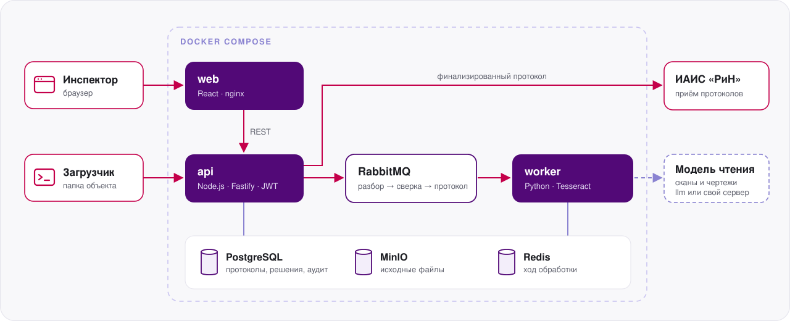
</p>

<details>
<summary><b>Контейнеры</b></summary>
<br>

| Контейнер | Стек | Назначение |
|---|---|---|
| `web` | React, Vite, nginx | интерфейс инспектора |
| `api` | Node.js 22, Fastify | REST API, JWT с ролями, проверка файлов при загрузке |
| `worker` | Python 3.11, Tesseract | разбор, сверка по Матрице, сборка протокола |
| `postgres` | PostgreSQL 16 | объекты, процессы, протоколы с версиями, решения, аудит |
| `rabbitmq` | RabbitMQ 3.13 | очередь шагов: разбор, сверка, протокол |
| `redis` | Redis 7 | ход обработки |
| `minio` | MinIO | исходные файлы по SHA-256 содержимого |
| `iais` | Node.js | заглушка ИАИС «РиН» |
| `llm` | vLLM, Qwen3.6-27B FP8 | модель чтения на видеокарте, только на стенде с видеокартой |
| `prometheus`, `grafana` | Prometheus, Grafana | метрики и панель, профиль `monitoring` |

</details>

## API

REST API по OpenAPI 3.0 с JWT и ролями `inspector`, `admin`, `expert`. Swagger —
http://localhost:3000/api/docs, описание — [`service/openapi.json`](service/openapi.json).
Пример ответа в формате сдачи — [`contracts/examples/submission.json`](contracts/examples/submission.json),
протокол сервиса на открытом объекте Тюменская-5.

<details>
<summary><b>Основные методы</b></summary>
<br>

| Метод | Путь | Что делает |
|---|---|---|
| `POST` | `/api/v1/auth/token` | токен доступа |
| `POST` | `/api/v1/documents/upload` | пакет документов объекта, в ответе `process_id` |
| `GET` | `/api/v1/process/{id}/status` | статус и ход обработки |
| `GET` | `/api/v1/process/{id}/summary` | сводка протокола и карта 132 параметров |
| `GET` | `/api/v1/process/{id}/findings` | находки с решениями инспектора |
| `POST` | `/api/v1/findings/{id}/decision` | решение по кандидату |
| `POST` | `/api/v1/process/{id}/finalize` | финализация и передача в ИАИС «РиН» |
| `GET` | `/api/v1/process/{id}/report.pdf` | протокол в PDF, также `.docx` и `.xml` |
| `GET` | `/api/v1/process/{id}/protocol` | протокол в формате сдачи, JSON |

</details>

## Структура репозитория

| Папка | Содержимое |
|---|---|
| `service/` | веб-клиент, API, воркер, схема базы, мониторинг |
| `pipeline/` | конвейер: реестр, чтение страниц, сверка, протокол |
| `rules/` | правила Матрицы: закрыты, сборка выкачивает их по токену ([подробнее](rules/README.md)) |
| `contracts/` | JSON-схемы протокола, находки, реестра и страницы; пример ответа сервиса |
| `dictionary/` | словарь марок, синонимов и сокращений |
| `docs/extracted/` | каталог 132 параметров Матрицы и реестры документов объектов |
| `tools/` | загрузчик папки объекта, восстановление имён файлов |
| `tests/` | проверки конвейера |
| `deploy/` | стенд с видеокартой и облачный стенд с TLS |
| `licenses/` | лицензии сторонних компонентов образов ([сводка](licenses/README.md)) |

## Лицензия

Код репозитория — [Apache License 2.0](LICENSE). Сторонние компоненты образов — по своим
лицензиям, перечень в [`licenses/`](licenses/README.md). Образ worker включает PyMuPDF под
AGPL-3.0; правила Матрицы — отдельные данные, лицензия на них не распространяется. Подробнее —
[`NOTICE`](NOTICE).
