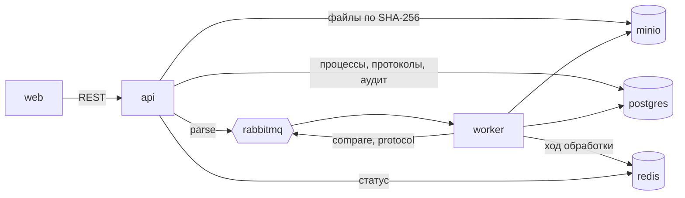

# Сервис «Инспектор ИИ»

Веб-сервис по ТЗ: загрузка папки объекта, асинхронная обработка очередью, протокол
проверки и файл сдачи организатору, верификация инспектором, финализация, передача
в ИАИС «РиН» и набор решений для дообучения. Задачи #32, #33, #30, #34.

```bash
docker compose up --build
```

Перед первой сборкой положите в `.env` токен доступа к правилам Матрицы (`RULES_TOKEN`,
[rules/README.md](../rules/README.md)) или запустите `./build.sh`: он спросит токен сам.

| Что | Адрес |
|---|---|
| веб-клиент | http://localhost:8080 — вход `inspector / inspector` или `admin / admin` |
| API и Swagger | http://localhost:3000/api/docs, описание — [openapi.json](openapi.json) |
| RabbitMQ | http://localhost:15672 — `guest / guest`, пользователь образа по умолчанию |
| MinIO | http://localhost:9001 — пользователь `inspector`, пароль ниже |
| заглушка ИАИС «РиН» | http://localhost:8090/mock/received — что пришло, режим меняется `POST /mock/mode` |
| Prometheus, Grafana | http://localhost:9090, http://localhost:3001 — только с `docker compose --profile monitoring up` |

Паролей в репозитории нет. При первом запуске сервис `secrets` генерирует пароль базы,
пароль хранилища и ключ подписи токенов в томе `secrets`, остальные контейнеры читают
их из файлов (`DATABASE_PASSWORD_FILE`, `S3_SECRET_KEY_FILE`, `JWT_SECRET_FILE`).
Пароль, например для консоли хранилища:

```bash
docker compose run --rm secrets cat /secrets/minio_password
```

Порты открыты только на этой машине. Учётные записи `inspector`, `admin` и `expert` — стендовые;
для любого другого контура задайте свои в `AUTH_USERS`.

Провести папку объекта целиком из командной строки:

```bash
python tools/upload_object.py --folder "data/Новослободская" --object-id OBJ-NOVOSLOBODSKAYA
```

Загрузчик входит учётной записью `admin` и грузит без лимитов размера: лимиты ТЗ относятся
к загрузке в браузере (см. «Что проверяется на загрузке»). На другом контуре передайте
его учётную запись: `--login … --password …`.

## Состав

| Контейнер | Стек | Роль |
|---|---|---|
| `web` | React, Vite, TypeScript, nginx | загрузка папки пакетами, ход обработки, протокол, решения, финализация |
| `api` | Node.js 22, Fastify, TypeScript | REST по OpenAPI 3.0, JWT с ролями inspector, admin и expert, проверка файлов при загрузке |
| `worker` | Python 3.11, Tesseract | шаги обработки из очереди: конвейер `pipeline/` как есть |
| `postgres` | PostgreSQL 16 | объекты, процессы, файлы, протоколы с версиями, находки, аудит, уведомления |
| `rabbitmq` | RabbitMQ 3.13 | очереди `parse` → `compare` → `protocol`; узел `rabbit@rabbitmq`, очереди и сообщения в томе `rabbitmqdata` переживают пересоздание контейнера (Р-132) |
| `redis` | Redis 7 | ход обработки для опроса статуса, сводка разбора по SHA-256 файла |
| `minio` | MinIO | исходные файлы, адресованные SHA-256 содержимого |
| `iais` | Node.js, образ API | заглушка ИАИС «РиН»: принимает финализированные протоколы, умеет отказывать |
| `prometheus`, `grafana` | Prometheus 2.54, Grafana 11.2 | метрики, правила оповещений и панель; профиль `monitoring` |



## Путь объекта

1. `POST /api/v1/documents/upload` принимает пакет файлов и возвращает `process_id`.
   Папка больше 200 МБ уходит несколькими пакетами в один процесс: у всех, кроме
   последнего, `final_batch=false`. Все пакеты и повторы одной загрузки несут общий
   `upload_key`: пакет без `process_id`, повторённый после потерянного ответа, попадает в уже
   заведённый процесс, а повтор принятого последнего пакета получает `already_accepted=true`
   и не ставит разбор второй раз. Пакет, где не принят ни один файл, у известного процесса
   записывает отказы и отвечает 422 с `details.process_id`; разбор после последнего пакета
   ставится, только если загрузка приняла хотя бы один файл.
2. После последнего пакета разбор ставится в очередь. Воркер выполняет шаги отдельными
   процессами: `parse` — реестр, чтение страниц, основная надпись; `compare` — правила
   Матрицы; `protocol` — проекция в формат сдачи и запись версии протокола.
3. Клиент опрашивает `GET /api/v1/process/{id}/status`, пока `processing.state` не станет
   `DONE`, и забирает файл сдачи `GET /api/v1/process/{id}/protocol` или протокол проверки
   `GET /api/v1/process/{id}/report` (`.pdf`, `.xml`).
4. Инспектор решает по кандидатам `POST /api/v1/findings/{id}/decision` и финализирует
   `POST /api/v1/process/{id}/finalize`. Финализированный протокол уходит в ИАИС «РиН»,
   его решения — в черновик набора примеров. Отменить финализацию может только администратор.

Дозагрузка в процесс со статусом READY, VERIFYING или COMPLETED пересобирает протокол
новой версией; прежние версии остаются, решения инспектора переносятся по идентификатору
находки.

## Интерфейс инспектора

Задача #33. Клиент показывает только то, что отдаёт API: демонстрационных данных, подставного
входа и переключателя ролей в нём нет.

- **Объекты** — реестр последних проверок со светофором. Зелёный только когда нарушений
  нет и сравнить удалось всё; если часть параметров не сравнилась, объект проверен
  не полностью.
- **Новая проверка** — загрузка папки объекта пакетами до 200 МБ.
- **Экран верификации** — три колонки на высоту экрана. Слева пять таблиц протокола
  из ТЗ (комплектность и сопоставимость, кандидаты, подтверждённые, отрицательные,
  гипотезы) и статусы загрузки по стадиям. В центре карточка «ПД — РД»: значения,
  цитаты, файл, страница и лист, правило Матрицы, критичность. Справа страницы ПД и РД
  с облаком изменений вокруг места расхождения. Действия шапки — значками с подсказкой
  по наведению: выгрузить, печать, дозагрузить, журнал аудита (у администратора),
  финализировать. Данные объекта в шапке — одной строкой от начала средней колонки
  до значков: объект, статус, сколько ждут решения, документы по стадиям (частично
  загруженная — пунктиром, сценарий проверки — в подсказке), версия протокола (очереди
  Матрицы — на экране от 1400 px, конвейер — в подсказке) и передача в ИАИС (видна всегда:
  «не передан», «ожидает · 2 из 4», «передан», номер и ошибка — в подсказке). Тесно —
  первым укорачивается название объекта. «Выгрузить» — протокол проверки
  в PDF, JSON и XML и файл сдачи организатору. Файл сдачи собирается по решениям на
  момент выгрузки (#63): отклонённая инспектором запись в него не идёт, подтверждённая
  гипотеза свободного поиска идёт, записи без решения остаются. Сколько убрано и
  добавлено, сказано строкой после выгрузки и заголовками ответа `X-Checks-Rejected`,
  `X-Checks-Promoted`, `X-Checks-Undecided`.
- **Набор решений** (администратор) — черновик примеров из финализированных протоколов
  и выпущенные версии набора.

В строке списка записей — мини-пометки значком с подсказкой по наведению (#80): уверенность
в выводе ниже высокой (столбики, как уровень сигнала) и решение специалиста (человек со знаком:
подтверждено, не хватило данных, не нарушение, показывать гипотезой, не показывать). Решение
бывает о виде гипотезы и об этой записи — подсказка говорит, о чём (Р-108). Виды, которые
специалист решил не показывать, по решению пользователя видны: в конце таблицы гипотез, у
«элемент проекта не найден в РД» — с низкой уверенностью (элемент искали по словам проекта).
Отбора по пометкам нет — это сведения о записи, а не способ разложить список.
Уверенность — уровень без процента: высокая,
средняя или низкая, выведенная из признаков записи — чем прочитано значение, к чему привязано,
сколько страниц его подтверждают, нет ли соперничающего значения или похожего на ошибку
распознавания. В карточке уровень стоит вместе с этими признаками.
Уровень есть у записи, где сравнение состоялось по значениям, прочитанным правилами, и у записи,
для которой разбор сам назвал довод: у «элемент проекта не найден в РД» значений нет, но элемент
искали по словам проекта, и это довод против (Р-108);
пометка «требует подтверждения» у гипотез его не роняет — это правило, а не сомнение в
данных. Считает его API (`service/api/src/confidence.ts`) из тела находки, поэтому он есть и
у записей, собранных до #80. Там же, в `GET /api/v1/process/{id}/findings`, — статус по
легенде организатора (`finding_status`) и решение специалиста (`specialist`).

Под комплектностью стадий на экране верификации — блок «Полнота обработки документации»
(#39, название по #74): сколько
страниц прочитано, сколько файлов осталось без стадии и без раздела, включались ли
распознавание и модель. Те же числа — в разделе 1 выгруженного протокола. Ссылка «файлы»
открывает список файлов процесса: там видно, почему файл не принят, и там же задаётся
стадия и раздел, если по названиям папок их определить не удалось. Правка идёт в журнал
аудита (`FILE_STAGE_SET`) и переживает повторный разбор; в протокол она попадает после
пересборки — кнопка под таблицей. Там же — редакции (#10): у файлов одной цепочки видно,
какая редакция актуальна, какая устарела, а где порядок не определён («требует уточнения»);
инспектор может назвать актуальную редакцию сам (`POST /api/v1/process/{id}/files/{fileId}/revision`,
в аудите `FILE_REVISION_SET`), и после пересборки записи с конфликтом редакций сравниваются заново.

**Что изменилось между редакциями** (#81). У файла, который в цепочке идёт после другой
редакции, в колонке «Редакция» есть ссылка «что изменилось»: по строке на изменённый лист —
числа «было → стало», стоящие на одном месте, и отмечено ли изменение. Отметку ищут там,
где её ставит проектировщик: номер нового изменения в таблице изменений штампа листа или
«Изм. N (Зам.)» у листа в ведомости рабочих чертежей. Лист, где сменились только дата выдачи,
подписи или перенос строк, отделён от листов с изменённым содержанием. Щелчок по листу
открывает сравнение «было — стало» во весь экран, места изменений обведены так же, как зона
доказательства. У находки, чей лист изменён в последней редакции, под страницей стоит строка
«лист изменён в изм. N · сравнить» — это «ссылка на согласованное изменение» ТЗ. Листы рабочей
документации, изменённые без отметки, попадают гипотезами `FREE-REV-UNMARKED` в таблицу 5
и в файл сдачи не идут, пока инспектор их не взял; их число — строкой в блоке полноты обработки.
Данные — `GET /api/v1/process/{id}/revisions` (указатель пар) и
`GET /api/v1/process/{id}/files/{fileId}/changes` (подробности пары); страницы пар воркер рисует
при разборе: рабочую документацию — всю, тома проекта — до 300 страниц за разбор.

**Что система прочитала в файле** (#52). В таблице файлов у каждого принятого файла есть
ссылка «что прочитано»: текст страниц в том виде, в каком его читали правила, и у каждой
страницы сказано, чем она прочитана — текстовым слоем, распознаванием или моделью.
На сканах текст даёт распознавание, и по нему принимаются решения, поэтому инспектору
нужно видеть его целиком, а не только в цитате доказательства: по нему сразу видно,
почему правило не нашло значение. Текст показывается как есть, без правки. Данные —
`GET /api/v1/process/{id}/text/{file_id}?from=&limit=`, текст кладёт шаг `parse`
в хранилище `texts/<sha256>.jsonl`.

Страницы-доказательства рисует шаг `protocol`: JPEG по 2200 точек по длинной стороне
в хранилище `renders/<sha256>/<страница>.jpg`, клиент берёт их через
`GET /api/v1/process/{id}/pages/{file_id}/{page}`. Место на странице ищется по текстовому
слою (`pipeline/evidence.py`): само значение в разных записях числа, строки ведомости,
из которых сложена сумма, или номер помещения. Откуда взято место, написано под
страницей. Если место не найдено, облака нет, и карточка так и говорит: рамки
«по умолчанию» не бывает. Карточка показывает фрагмент листа вокруг облака, по щелчку
страница открывается целиком с масштабом.

Повторный разбор запускается из реестра кнопкой «Пересобрать протокол» — она видна всегда,
а не только после правки, потому что пояснения обещают «вступит в силу после повторного
разбора». Слово «журнал аудита» в пояснениях — ссылка на журнал для администратора;
инспектору подсказка говорит, что журнал открывает администратор (`/api/v1/audit` — его
право). И пересборка, и перечитывание спрашивают подтверждение: это работа на минуты.

Реестр «Файлы объекта» отбирает файлы по вкладкам: все, без стадии, без раздела, редакции,
не приняты. Строки готовности в левой колонке ведут в нужный отбор одним щелчком — «задать
стадию», «задать раздел», «не принято при загрузке». В отбор «без раздела» попадают только
проектная и рабочая документация: у исполнительной раздела проекта не бывает, и цифра в
блоке готовности считает их вместе, поэтому под вкладкой сказано, сколько из них ИД (#74).

Администратору в блоке готовности видно, на скольких страницах модель не ответила и сколько
из них зациклилось, и там же кнопка «перечитать»: она спрашивает подтверждение и ставит разбор
в очередь. Модель зовётся только там, где её ответа в источниках страницы нет — остальное
берётся из кеша, решения инспектора при пересборке сохраняются. Инспектору эти числа
не показываются.

Идущая обработка при готовом протоколе не занимает экран проверки: она показана одной строкой
(«идёт» или «стоит в очереди»), а вся очередь — сверху в реестре объектов, блок «Очередь
обработки». В нём по порядку: что обрабатывается сейчас (шаг, ход), что ждёт — по времени
постановки, с номером в очереди (воркер берёт задания по одному, `prefetch_count=1`), загрузки
из этого окна браузера и загрузки, у которых сервер принял не все пакеты. Большой блок с шагами
остаётся там, где показывать больше нечего: первая обработка объекта и сбой.

Загрузка папки идёт из браузера пакетами, и сервер узнаёт об объекте только после первого пакета.
Поэтому ход загрузки живёт не в экране «Новая проверка», а в общем учёте окна
(`service/web/src/uploads.ts`): с экрана можно уйти, загрузка видна в очереди обработки,
закрыть вкладку браузер не даст без вопроса. Когда загрузка кончилась, а человек уже на другом
экране, его не переносит на новый объект — объект и так виден в очереди.

Обрыв связи и ответ 5xx повторяются сами (через 2 и 6 с). Если и повтор не прошёл, в панели
и в очереди появляется «Продолжить с пакета N»: загрузка продолжается в тот же процесс, с тем же
ключом и по тем же файлам, что были выбраны тогда. «Очередь недоступна» значит, что файлы уже
приняты, — клиент не шлёт их снова, а запускает разбор. На экране проверки у незаконченной
загрузки — «Догрузить файлы» и «Начать разбор с принятыми»; пока из этого же окна идёт своя
загрузка, вместо них виден её ход, а финализация, пересборка и перезапуск недоступны.

Отбор в реестре объектов (ТЗ, модуль 7: фильтры по разделам, статусам, датам). Три
измерения вместе с поиском: состояние по светофору; раздел Матрицы — объекты, у которых
в разделе есть записи, ждущие решения, или подтверждённые нарушения (показаны только
разделы, где такие объекты есть); дата последнего изменения — сегодня, 7 и 30 дней или
период с датами. Число на каждой кнопке считается с учётом остальных отборов — сколько
объектов останется, если нажать её. Разделы по записям отдаёт `findings.by_section`
в статусе процесса: ключ — начало кода параметра (PZ, KR, IOS4…), гипотеза свободного
поиска относится к разделу по второму слову кода и учитывается, только если взята
в кандидаты.

Дашборд объекта (#83): кнопка «Дашборд» рядом с «Лог» в строке реестра объектов. Карточка
показывает протокол одним экраном: вывод реестра, главные числа (сопоставлено параметров,
подтверждённые нарушения, ждут решения, проверено без замечаний), загрузку стадий и передачу
в ИАИС, решения инспектора, изменения к прошлой версии и карту всех 132 параметров Матрицы
по разделам. Клетка — параметр; состояние: нарушение, кандидат, без замечаний (цветом и знаком
«! ? ✓»), несопоставимо, нет доказательств, неприменимо, не проверено (фактурой). Палитра
проверена на различимость при дальтонизме; легенда оставляет на карте одно состояние,
по карте ходят стрелками, щелчок по клетке открывает проверку сразу на записи параметра
(`#/process/{id}/finding/{uuid}`). Данные — `GET /api/v1/process/{id}/summary`: группы
параметров строит та же функция, что раздел 2 протокола (`parameterGroups`), поэтому числа
карточки и PDF не расходятся. Гипотезы свободного поиска в карту не входят (ТЗ 9.5),
«нет доказательств» — не нарушение (ТЗ 9.3); карточка только показывает, решения по
записям — в карточке записи.

Связи документов (#82). Вкладка «Связи
документов» в дашборде объекта: карта «стадии × разделы» — клетка показывает, сколько
документов раздела в стадии, дуга — находки, чьи доказательства лежат в двух стадиях, цветом
состояния записи; щелчок по дуге оставляет в списке находки этой связи, справа — контекст
выбранной. Тот же контекст — свёрнутой панелью «Связи документов» в карточке находки на экране
проверки: грузится, только когда её раскрыли, путь к решению не удлиняется. Контекст —
документы доказательства по стадиям ПД, РД, ИД со страницами, цитатой и редакцией
(«актуальная» или «заменена → актуальная»), та же проверка на других участках объекта и где
ещё встречается помещение. Индекс помещений (номер → файлы) воркер кладёт в отчёт протокола
из `rooms.jsonl`; у протокола, собранного до этого, индекса нет, и панель просит пересобрать.
Фильтры ложных связей: номер из одной-двух цифр (часто это номер строки таблицы) и помещение
больше чем в 8 документах (поэтажный план, сводная ведомость) связи не дают, заменённая
редакция в связи не входит — отсечённое можно показать отдельно. Смешанный комплект РД и ИД
стоит на карте в колонке РД, заголовок карты называет их число. Данные — `GET
/api/v1/process/{id}/links` и `GET /api/v1/process/{id}/findings/{fid}/context`, считаются
на лету; `pipeline/` и файл сдачи не меняются.

Журнал обработки объекта (#83). Наблюдения о качестве разбора — «чтение отметило низкое
качество на 82 страницах», «раздел не определён у 17 файлов» — на рабочем экране инспектора
читались как дефект объекта и отвлекали от разбора записей. Теперь у уведомления есть вид:
`ACTION` — нужно действие человека, `QUALITY` — наблюдение о разборе, `INFO` — событие.
На экране проверки показываются только первые два вида, по одной свежей записи каждого;
всё остальное собрано в журнале: кнопка «Лог» в строке реестра объектов и ссылка «журнал»
в блоке полноты обработки. Данные — `GET /api/v1/process/{id}/log`: способ чтения и модель,
числа готовности, повторяющиеся наблюдения одной строкой со счётчиком разборов, версии
протокола с изменениями, отклонённые при загрузке файлы и все уведомления по процессу.

Исходный файл открывается целиком: в шапке карточки листа — кнопка со знаком документа,
`GET /api/v1/process/{id}/files/{file_id}/source` отдаёт файл, как его загрузили
(`blobs/<sha256>`), с `Content-Disposition: inline`, и браузер показывает PDF своим
просмотрщиком сразу на странице доказательства. Инспектору это нужно, когда страницы
мало: посмотреть соседние листы, штамп, ведомость. Запрос идёт с токеном, поэтому клиент
забирает файл `fetch` и открывает вкладку по object URL, а не ссылкой.

Решения (ТЗ 9.3, задача #43): 1 — подтвердить, 2 — отклонить, 3 — уточнить, стрелки или j/k —
по списку; клавиша решения — полузаметной цифрой в углу кнопки, остальное — в подсказке
кнопки. Клавиша решения срабатывает только когда
в центре открыта карточка кандидата без решения и нажата без модификаторов: при открытом
журнале, списке отклонённых файлов или дозагрузке она ничего не решает (разбор — в
`web/src/keys.ts`). Комментарий инспектора можно оставить при любом решении, он уходит в аудит
и в протокол; Ctrl+Enter в поле комментария подтверждает нарушение.

Отклонение укладывается в три действия: клавиша 2, цифра причины 1–5, Ctrl+Enter. Причина
из перечня ТЗ и комментарий обязательны; после выбора причины фокус сам уходит в комментарий.

Кандидаты отсортированы по риску: нерешённые выше решённых, критические выше существенных.
Карточка показывает у каждого источника редакцию документа, SHA-256 файла и статус утверждения,
когда он известен, а также параметр Матрицы и его норму — то, чем нарушение обосновано.
Исполнительная документация — третья колонка, когда по ней есть значение или страница;
итог сверки построенного с рабочей стадией — строкой под колонками (#42). У значения видно,
чем оно получено: строка «прочитано распознаванием» — текст страницы прочитан машиной, тег привязки — значение
элемента взято с листа, со страницы или по пути файла, а не из указаний; запись, которую
система не решает сама (нарушение по распознанному значению, расхождение со слоем, отложенное
как похожее на ошибку чтения), несёт чип «требует подтверждения» с причиной в поле
«Расхождение» (#41, Р-40). API отдаёт это полями `sources.{pd,rd,id}` (`text_source`, `binding`),
`id_value`, `id_check`, `needs_expert`.
Решение возвращается в кандидаты из карточки или из строки уведомления. В статусе COMPLETED
(верификация завершена) сервер принимает только это действие.

Кандидата без решения с несколькими локациями можно разделить: исходная запись помечается
`SPLIT` и переживает пересборку протокола, части получают собственные решения. Запись
свободного поиска (таблица 5) кандидатом не считается: она не задерживает финализацию, и
решение по ней сервер не примет, пока инспектор не нажал «Взять в кандидаты» (ТЗ 9.2, Д-37).
Финализация доступна, когда нет кандидатов без решения (по ТЗ запрос уточнения тоже считается
обработкой); отменить её может администратор с указанием причины. Журнал аудита виден
администратору, уведомления своей роли по процессу — в строке над протоколом.

## Протокол проверки

Задача #30. Два документа из одних и тех же записей. **Файл сдачи**
(`/protocol`) — формат организатора для подсчёта балла. **Протокол проверки**
(`/report`, `/report.pdf`, `/report.docx`, `/report.xml`) — документ для инспектора по образцу
«Протокола автоматизированной сверки» из существенной редакции ТЗ
(`data/02_ЭТАЛОННАЯ_РАЗМЕТКА_И_МЕТОДИКА/tz_substantive_revision_20260817/02_Протокол_сравнения_существенная_редакция.docx`):

- шапка: объект, дата, версия, статус (`AWAITING_VERIFICATION`, `VERIFICATION_COMPLETED`,
  `PROTOCOL_FINALIZED`), передача в ИАИС; трассируемость — `process_id`, версии Матрицы,
  набора, конвейера, время прогона, SHA-256 манифеста входных файлов;
- раздел 1 — статус загрузки по стадиям и тип проверки (сценарий), отклонённые файлы
  с причинами; отдельные файлы подписи `.sig`, `.p7s`, `.sgn` частичной загрузки не дают;
  при загруженной исполнительной документации — `id_coverage`: у каких параметров значение
  в ней найдено, у каких нет (#42);
- раздел 2 — все 132 параметра по группам без пересечений (сопоставлено, нет
  доказательств, несопоставимо, не проверено), записи по статусам и та же сводка по разделам;
- таблицы: 1 комплектность и сопоставимость, 2 кандидаты высокого и среднего риска,
  3 подтверждённые нарушения, 4 проверенные отрицательные результаты, 5 гипотезы;
  параметры без правила с причиной;
- резолютивная часть — только после финализации и только подтверждённые нарушения;
- изменения к прошлой версии: добавленные, пропавшие и изменившиеся записи, решения на пересмотр;
- карточки доказательств: ожидаемое и фактическое значения, источники с файлом, SHA-256,
  страницей, листом, шифром, редакцией и рамкой в координатах ТЗ, устаревшие редакции
  с другими значениями, статусы и решение эксперта; правила подсчёта. У записи —
  `needs_expert` и `recognized_stages`: стадии, чьё значение прочитано распознаванием (#41).

Статус записи: `CANDIDATE` (расхождение ждёт решения), `CONFIRMED_VIOLATION`,
`NEGATIVE_VERIFIED` (сравнено, расхождения нет, или кандидат отклонён),
`CLARIFICATION_REQUIRED`, `MISSING_EVIDENCE` (стадия не загружена или значение не найдено),
`NOT_COMPARABLE` (значения есть, но сопоставить нельзя), `SUSPICION` (вне итогов).
Параметру без реализованного правила ставится `NOT_CHECKED`: такого статуса в ТЗ нет,
но без него непроверенное выглядело бы проверенным. Если значения нет потому, что стадия
в процесс не загружена вовсе, запись и в файле сдачи отмечается как отсутствие документа:
`MISSING_DOCUMENT` со статусом `PD_MISSING` или `RD_MISSING` из перечня организатора. Расчёт покрытия и изменений версии —
`pipeline/protocol.py`, сборка документа — `api/src/report.ts`, PDF — `api/src/report-pdf.ts`
(шрифт DejaVu из образа, путь задаётся `PDF_FONT_REGULAR` и `PDF_FONT_BOLD`), DOCX —
`api/src/report-docx.ts`. Содержание у PDF и DOCX одно: оба собираются из блоков
`api/src/report-blocks.ts` (заголовки, пояснения, таблицы), различается только вёрстка —
в Word шапка таблицы повторяется на каждой странице, строка не рвётся между страницами,
в колонтитуле «Лист N из M» (ТЗ, модуль 7: «экспорт протоколов в PDF, DOCX, XML»).

Сравнение идёт по последней редакции тома; устаревшая эталоном не становится (ТЗ 9.1), но
если значение в ней другое, карточка это показывает: «Сравнение по редакции «кор.3».
Устаревшие: «исходная» — 3987,30». При дозагрузке решение переносится по идентификатору
записи; если значения записи изменились, карточка просит пересмотреть решение, инспектор
получает уведомление.

Дозагрузка не запускает объект заново (#60): читаются только новые документы, а
пересчитываются только те параметры, по которым они дали значения. Остальные записи
переносятся из прошлой версии протокола с решениями инспектора и помечены в карточке
«из версии N»; числа — в блоке «Готовность объекта», в печатном протоколе и в поле
`recompute` статуса процесса. На Тюменской-5 дозагрузка одного акта — 27 секунд вместо
121. Считается всё заново, когда документ пропал
или заменён, когда новый документ встал в цепочку редакций к прежнему, когда инспектор
поправил стадию и когда изменились правила Матрицы.

## Передача в ИАИС «РиН»

Задача #34, ТЗ 9.6. После финализации протокол ставится в очередь передачи:
`POST {IAIS_URL}/api/v1/inspection/{process_id}` с подтверждёнными нарушениями
(значения, доказательства со страницами, SHA-256 и рамками), версиями протокола, Матрицы
и конвейера и реестром входных файлов; SHA-256 тела — в заголовке `X-Payload-SHA256`.
Ответ 5xx, таймаут или обрыв — до трёх повторов через 1, 5 и 15 минут (`IAIS_RETRY_DELAYS_S`).
Пока передача не удалась, протокол остаётся `FINALIZED`, передача — `PENDING_SYNC`;
после последней попытки администратор получает уведомление и может повторить передачу
`POST /api/v1/process/{id}/sync` или кнопкой на экране верификации. Ответ 4xx повтором
не лечится: `REJECTED` и уведомление. Отмена финализации снимает неотправленную передачу.
Подпись запроса УКЭП на стенде не выполняется.

## Набор решений

Задача #34, ТЗ 9.4, экран «Набор решений» у администратора. Черновик — решения
финализированных протоколов: подтверждённое нарушение — положительный пример, отклонённый
кандидат с кодом причины — отрицательный; уточнения и записи без решения не входят.
Черновик не хранится, а считается, поэтому отмена финализации убирает решения процесса
сама. Куратор выпускает версию `POST /api/v1/dataset/release` — неизменяемый снимок
черновика целиком с разницей к прошлой версии (добавлено, изменено, убрано);
идентификатор `ds-…` — хеш состава. `GET /api/v1/dataset` — черновик,
`?dataset_version=…` — состав версии.

Ошибочную версию не удаляют, а отзывают: `POST /api/v1/dataset/versions/{version}/withdraw`
с обязательной причиной (#74). Версия остаётся в истории — на неё ссылаются протоколы, —
но в дообучение не берётся; кто и почему отозвал, видно в списке версий и в журнале аудита
(`DATASET_WITHDRAW`). Сами решения исправляют отменой финализации и новой версией.

Черновой объект удаляется целиком: `DELETE /api/v1/objects/{id}` (администратор, #74).

## Правила для эксперта

Роль `expert` (Р-134) работает с правами инспектора и вдобавок видит все правила сверки: страница
«Правила» в рельсе под «Набором решений». Остальным ролям, администратору тоже, страница не
показывается, а `GET /api/v1/rules` отвечает 403.

Правила — те, которыми разбирает воркер. Файлы правил лежат в его образе, поэтому воркер при старте
кладёт их снимок в таблицу `rule_snapshots` (`service/worker/rules_snapshot.py`): очереди Матрицы,
черновики, каталог 132 параметров, решения специалиста по видам свободного поиска. `GET /api/v1/rules`
отдаёт последний снимок в виде для чтения (`service/api/src/rules.ts`): состояние параметра, триггер и
источники Матрицы, сравнение и порог, документы и подписи поиска, вопрос модели по чертежам, черновик и
пояснение без служебных ссылок. Пока воркер нового образа не стартовал, маршрут отвечает 404
`RULES_NOT_PUBLISHED`.

У каждого правила — тип бейджем (#222): **паттерн** — значение ищут шаблоны из файла правила,
**код** — свой разбор в конвейере, **LLM** — значение с чертежей читает модель. Тип считает
конвейер (`pipeline/rule_test.py`), воркер кладёт его в снимок правил.

**Трасса и песочница** (#222, #223, Р-142) — пробный прогон правила на проверках объектов,
который ничего не меняет: ни файлов правил, ни протоколов, ни решений инспектора.

- `POST /api/v1/rules/tests` ставит прогон: `code`, необязательные `variant` (поля правила поверх
  рабочего), `process_ids` (без них — последняя проверка каждого объекта с протоколом) и `trace`.
  Вариант паттерна — подписи, исключения, порог и допуск; LLM — только порог и допуск. У правила
  с разбором в коде варианта нет: только трасса, вариант — `422 BAD_VARIANT`. Экран по умолчанию
  прогоняет вариант на выбранном объекте, по всем объектам — по выбору.
- Воркер берёт очередь `ruletest` после шагов обработки документов и считает по объекту за раз:
  веса страниц — по всей очереди из кеша, как в рабочем прогоне, кандидаты варианта — без кеша.
- `GET /api/v1/rules/tests/{id}` — ход и итог по объектам: записи рабочего правила, вариант и
  разница с ним (появится, пропадёт, изменится), решения инспектора, с которыми вариант спорит,
  трасса по стадиям; у ждущего прогона — `ahead`, сколько прогонов перед ним. `GET /api/v1/rules/tests?code=…` —
  последние прогоны правила: по ним страница показывает свой прогон снова, когда к правилу вернулись.
  Прогоны старше двух недель убираются.
- `GET /api/v1/rules/tests/estimate` — примерное время трассы и варианта по объектам: быстрейший
  из трёх последних прогонов на проверке, без них — по числу страниц. Первый прогон после выкладки
  пересобирает кеш и идёт в разы дольше.
Удаляются только объекты без финализированных протоколов и без идущей обработки: протокол —
документ с решениями инспектора и записью в ИАИС «РиН». Вместе с объектом уходят его
процессы, файлы, находки и черновые протоколы; журнал аудита (там появляется `OBJECT_DELETE`),
уведомления и выпущенные версии набора остаются. Из хранилища удаляется только содержимое,
на которое больше никто не ссылается: оно адресовано по SHA-256 и может принадлежать
другому объекту.

## Метрики и логи

Задача #34, ТЗ раздел 13. `GET /metrics` у API в формате Prometheus:

| Метрика | Что |
|---|---|
| `inspector_http_requests_total`, `inspector_http_request_duration_seconds`, `inspector_http_errors_5xx_total` | запросы по маршруту и коду, время ответа, ошибки 5xx |
| `inspector_active_sessions` | пользователи с запросами за 15 минут |
| `inspector_queue_messages` | сообщения в очередях `parse`, `compare`, `protocol`; без соединения с брокером значений нет (Р-135) |
| `inspector_processes`, `inspector_findings` | процессы по статусу, записи по статусу верификации |
| `inspector_iais_sync`, `inspector_iais_sync_attempts_total`, `inspector_iais_sync_seconds` | передачи в ИАИС |
| `inspector_dataset_items` | примеры в черновике и в последней версии набора |
| `inspector_worker_step_runs_total`, `inspector_worker_step_seconds_total`, `inspector_worker_resource` | шаги воркера, время, память, процессор; воркер пишет их в Redis |
| `inspector_api_process_*`, `inspector_disk_bytes` | процессор, память и диск API |

`docker compose --profile monitoring up` поднимает Prometheus с правилами
[monitoring/alerts.yml](monitoring/alerts.yml) (процессор больше 80 %, 95-й процентиль ответа
больше 500 мс, ошибки 5xx, очередь, передачи в ИАИС, молчащий воркер) и Grafana с панелью
«Инспектор ИИ». Пароль администратора Grafana — `docker compose run --rm secrets cat
/secrets/grafana_password`, смотреть панель можно без входа. Доставка оповещений
(почта, мессенджер) — Alertmanager контура эксплуатации, в стенд не входит.

Логи API, воркера и заглушки — JSON в stdout с полями `timestamp`, `level`, `service`,
`message`, `request_id`, `user_id`. `request_id` — UUID запроса (или `X-Request-Id` от прокси),
он возвращается в заголовке ответа и уходит в сообщение очереди: по нему строки воркера всех
шагов обработки связываются с запросом загрузки.

## Что проверяется на загрузке

| Сценарий ТЗ | Ответ |
|---|---|
| формат не PDF, DOCX, XML | файл отклонён: `UNSUPPORTED_FORMAT` со списком форматов |
| повреждённый PDF | файл отклонён: `CORRUPTED_PDF`, «загрузите заново» |
| в браузере: файл больше `MAX_FILE_MB` (по ТЗ 50 МБ) | файл отклонён: `FILE_TOO_LARGE` с лимитом |
| в браузере: пакет больше `MAX_PACKAGE_MB` (по ТЗ 200 МБ) | пакет отклонён целиком: HTTP 413 `PACKAGE_TOO_LARGE` с лимитом |
| загрузчик папки объекта: файл или пакет любого размера | принят: у маршрута загрузчика лимитов нет, см. ниже |
| таймаут или сбой обработки | до двух повторов, затем уведомление администратора, `processing.state = FAILED`. Таймаут — зависание: шаг, который после срока показывает ход, идёт до предельного срока (#113) |

При загрузке PDF проверяется по началу и концу файла: оборванная передача не имеет
`%%EOF`. Файл, который прошёл эту проверку, но не открывается, воркер отклоняет при
разборе с той же просьбой загрузить заново.

## Статусы

`status` — жизненный цикл процесса из ТЗ: PENDING, PARSING, READY, VERIFYING,
COMPLETED, FINALIZED. Для сбоя обработки в ТЗ статуса нет, поэтому состояние задания
вынесено в `processing`: QUEUED, RUNNING, DONE, FAILED. Рядом — шаг, попытка и время:
`published_at` у QUEUED значит, что брокер принял поставленный воркером шаг. Если соединение
с брокером обрывается посреди шага, шаг идёт до конца, а следующий встаёт в очередь после
переподключения один раз (Р-131). `upload_status` — статусы
загрузки по стадиям (PD_UPLOADED, RD_PARTIAL, ID_MISSING…), `scenario` — тип проверки
(FULL, PD_RD_ONLY…, PARTIALLY_LOADED). По ТЗ 9.1 частичная загрузка перекрывает остальные
сценарии, поэтому протокол к `PARTIALLY_LOADED` дописывает, какой стадии не хватает:
«загружено частично (ПД — не приняты 2); исполнительная документация не загружена».

## Настройки

Переменные окружения compose, у всех есть значения по умолчанию.

| Переменная | По умолчанию | Смысл |
|---|---|---|
| `MAX_FILE_MB`, `MAX_PACKAGE_MB` | 50, 200 | лимиты ТЗ для загрузки в браузере; у загрузчика лимитов нет, см. ниже |
| `PIPELINE_PAGES` | 1 | читать страницы и основную надпись |
| `PIPELINE_OCR` | 1 | распознавать сканы и углы листов Tesseract: правила Матрицы читают этот текст (#52). Без кеша на шести потоках 47 страниц в минуту на А0 и А1, 130 на чертежах поменьше, 225–285 на записках |
| `PIPELINE_MODEL`, `INSPECTOR_OPENROUTER_API_KEY` | 1, пусто | модель читает прицельно: только сканы без текста и чертежи, у которых в текстовом слое меньше 40 слов. Без своей модели по `PIPELINE_MODEL_URL` или ключа способ понижается до распознавания; 0 — без модели. Ключ из `.env` конвейера сюда не попадает |
| `PIPELINE_READING_MODE` | `model` | способ чтения по умолчанию, когда инспектор не выбрал его при загрузке (#54): `layer`, `tesseract`, `model` |
| `PIPELINE_MODEL_URL`, `PIPELINE_MODEL_NAME`, `PIPELINE_MODEL_KEY_ENV` | OpenRouter, пусто, `OPENROUTER_API_KEY` | адрес, имя модели и имя переменной с ключом: тот же режим работает и со своей моделью на своём железе, и через OpenRouter. Ключ нужен не всякому адресу — свою модель обычно раздают без него |
| `PIPELINE_MODEL_CHOICES` | список по #71 (Р-55): `qwen3.6-27b`, `qwen3.6-35b-a3b`, `qwen3-vl-8b-instruct` | какие модели предлагать инспектору при загрузке: «идентификатор=Название» через запятую. Список читают API (показывает и проверяет) и воркер (читает выбранной). Пусто — выбор не предлагается, работает `PIPELINE_MODEL_NAME` |
| `PIPELINE_VLM` | 1 | прицельный проход по чертежам: вопрос модели по листу о значении, которого нет в тексте, — до 40 новых вопросов на объект, ответы кешируются. Идёт при любом способе чтения, кроме «только слой», если модель настроена |
| `PIPELINE_PROVISIONAL` | 1 | черновики правил из `rules/provisional`: их нарушения идут в протокол гипотезами, в сдачу — только решением инспектора |
| `PIPELINE_MODEL_MAX_TOKENS` | 4000 | потолок ответа модели: зациклившийся ответ обрывается и отбрасывается, а не тратит минуты вслепую |
| `PIPELINE_TABLE_OCR` | 1 | распознавать по ячейкам таблицы систем на листах без текстового слоя (сравнение по помещениям, #37): 3–4 минуты на два тома ОВ на шаге сравнения, затем из кеша. У объекта, загруженного способом «только текстовый слой», ячейки не распознаются независимо от этой переменной (#54) |
| `MAX_RETRIES`, `TIMEOUT_PARSE_S` | 2, 7200 | повторы и срок шага разбора |
| `TIMEOUT_PARSE_MAX_S`, `STALL_TIMEOUT_S` | 21600, 1800 | после срока шаг, который показывает ход (строки вывода, ход в Redis), идёт дальше — до предельного срока; молчащий дольше `STALL_TIMEOUT_S` снимается как зависший и повторяется (#113). У сравнения и протокола — `TIMEOUT_COMPARE_MAX_S`, `TIMEOUT_PROTOCOL_MAX_S`, по умолчанию втрое больше срока |
| `TIMEOUT_RULETEST_S` | 900 | срок пробного прогона правила на одном объекте (трасса и песочница эксперта, #222, #223): из кеша — секунды, после смены правил или кода — до минут на большом объекте. Дольше срока прогон на объекте снимается, прогон идёт по остальным |
| `RABBITMQ_CONSUMER_TIMEOUT_MS` | 86400000 (сутки) | сколько брокер ждёт подтверждения доставки. Воркер подтверждает шаг после его конца, поэтому срок брокера должен быть больше предельного срока любого шага: при умолчании RabbitMQ в 30 минут долгий разбор выполнялся второй раз (Р-130). Брокер берёт срок при создании контейнера `rabbitmq` |
| `AUTH_USERS` | `inspector:inspector:inspector,admin:admin:admin,expert:expert:expert` | учётные записи стенда: `логин:пароль:роль`, роли inspector, admin и expert |
| `IAIS_URL` | `http://iais:8090` | адрес ИАИС «РиН»; пустой — передача выключена |
| `IAIS_RETRY_DELAYS_S` | `60,300,900` | задержки повторов передачи, секунд; для показа — `10,20,30` |
| `IAIS_MOCK_MODE` | `ok` | режим заглушки: `ok`, `fail`, `reject`, `slow` |
| `LOG_LEVEL` | `info` | уровень логов API |
| `RULES_TOKEN` | пусто | токен доступа к закрытым правилам Матрицы: сборка воркера выкачивает по нему `rules/`, если правил нет в папке ([rules/README.md](../rules/README.md)) |

Кеш чтения `.cache/` подключён к воркеру из папки репозитория и в git не попадает. Он
адресован SHA-256 содержимого, поэтому документ, прочитанный однажды, заново не читается.

### Убрать проверочный объект со стенда

Удаление процесса уносит его пакеты загрузки, файлы, протоколы, находки и очередь
передачи: внешние ключи объявлены с `on delete cascade`. Журнал аудита, уведомления и
набор решений для дообучения ссылаются на процесс без ключа и остаются — запись о том,
что делали, переживает сам процесс.

```bash
docker compose exec postgres psql -U inspector -d inspector -c "delete from processes where object_id = 'UPL-XXXX'; delete from objects where id = 'UPL-XXXX';"
```

Объект удаляется отдельной командой намеренно: `objects` не каскадируется, чтобы
удаление объекта не унесло молча его проверки. Рабочий каталог процесса в томе `work`
и содержимое в хранилище так не удаляются — каталог чистится
`rm -rf /work/<process_id>`, содержимое адресовано SHA-256 и общее для процессов.

## Расхождения с ТЗ и корпусом

Ниже — отступления, которые видны оператору стенда.

**Лимит 50 МБ — только для загрузки в браузере.** Так ответил организатор на установочной
сессии (21:13, вопрос 18): лимиты ТЗ относятся к интерактивной загрузке инспектором, крупные
пакеты идут через бэк. Корпус лимит превышает: из 4 352 PDF десяти объектов 115 больше 50 МБ,
в них 37 % страниц, самый большой — 912 МБ («! ИД АР» Лосевской, 3 956 страниц). Среди них
действующие редакции ПЗ и ПЗУ Тюменской-5, ПЗ Полярной 16 со стороной ПД нарушения PZ-011,
вся ИД Лосевской и Полярной 16 и 94 % страниц ИД Речникова. Поэтому у загрузчика
(`tools/upload_object.py`) свой маршрут `POST /api/v1/documents/bulk` без лимитов размера,
роль `admin`; в браузере инспектор лимит не обходит (Р-110). Маршрут объявлен в `/health`
полем `limits.loader_path`. Nginx клиента и Caddy демо-стенда пропускают его без лимита тела,
тело идёт в API потоком. PDF на части не режутся: сдача ссылается на страницу исходного файла.

**Архивы и DWG ТЗ не принимает.** В корпусе они есть (Речников, Октябрьская): архивы
дублируют уже распакованное, DWG пока не читается. Сейчас такие файлы отклоняются
с перечнем форматов.

**Протокол выгружается в JSON, PDF и XML, но не в DOCX** и не подписывается УКЭП:
ТЗ 9.2 требует JSON и PDF, XML добавлен для обмена; подпись — в контуре Мосстройнадзора.

**Образ MinIO.** В Docker Hub `minio/minio` больше не раздаётся, официальный образ
берётся из `quay.io/minio/minio`.

## Разработка без Docker

```bash
cd service/api && npm install && npm run build && npm run openapi   # обновить openapi.json
cd service/web && npm install && npm run dev                        # клиент на :5173, API на :3000
```
